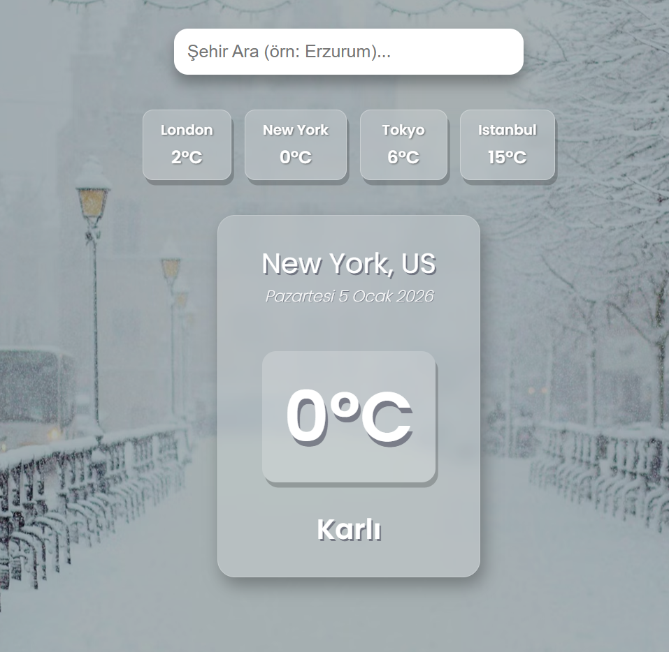

# 🌦️ React Hava Durumu Uygulaması

Bu proje, **BTE311** dersi final ödevi kapsamında geliştirilmiştir. React.js ve OpenWeatherMap API kullanılarak, aranan şehrin anlık hava durumunu gösteren ve arka planı hava koşullarına göre dinamik olarak değiştiren bir web uygulamasıdır.

## 🔗 Canlı Demo (Live)

Projeyi tarayıcıda görüntülemek için tıklayın:
👉 **[https://ahmetaykut33.github.io/Ahmet_AykutBTE311/hava-durumu/](https://ahmetaykut33.github.io/Ahmet_AykutBTE311/hava-durumu/)**

## 🚀 Özellikler

* **API Entegrasyonu:** OpenWeatherMap üzerinden anlık sıcaklık, şehir ve hava durumu bilgisi çekilir.
* **Dinamik Arka Plan:** Hava durumuna göre (Güneşli, Yağmurlu, Karlı, Sisli) arka plan görseli otomatik değişir.
* **Arama Modülü:** Kullanıcı istediği şehri yazıp Enter'a basarak sorgulama yapabilir.
* **Hızlı Erişim Kartları:** İstanbul, Londra, New York gibi popüler şehirlerin durumu tek tıkla görülebilir.
* **Türkçe Arayüz:** API'den gelen veriler Türkçe karşılıklarıyla gösterilir.

## 🛠️ Kullanılan Teknolojiler

* **React.js** (Hooks: `useState`, `useEffect`)
* **JavaScript (ES6+)**
* **CSS3** (Glassmorphism Tasarım)
* **Fetch API**

## 💻 Kurulum (Localhost)

Bu projeyi kendi bilgisayarınızda çalıştırmak isterseniz:

1.  Bu repoyu klonlayın veya indirin.
2.  Terminalde `hava-durumu` klasörüne gidin.
3.  Gerekli paketleri yükleyin:
    ```bash
    npm install
    ```
4.  Projeyi başlatın:
    ```bash
    npm start
    ```

    ## 📸 Ekran Görüntüleri

### Güneşli Hava Görünümü


### Karlı Hava Görünümü


---
*Geliştirici: Ahmet Aykut*
